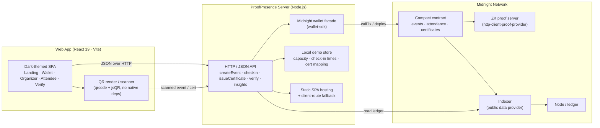
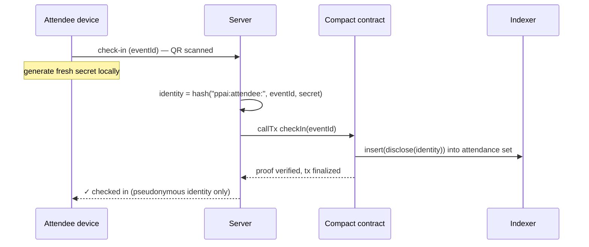
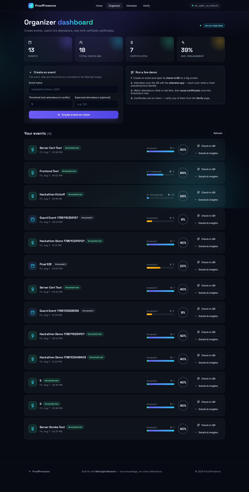
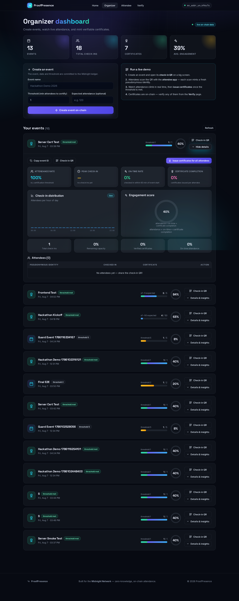
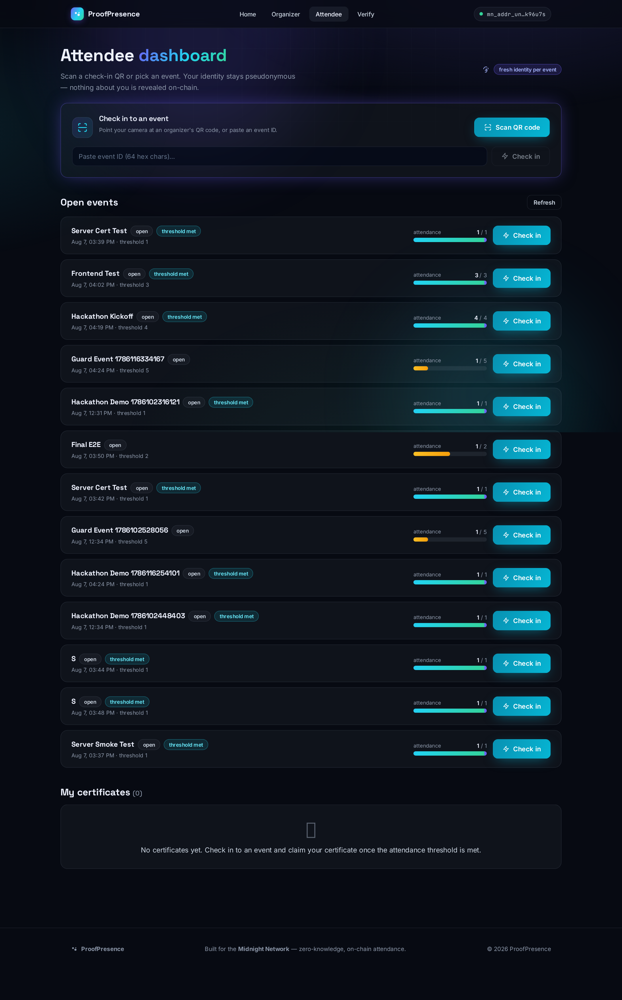
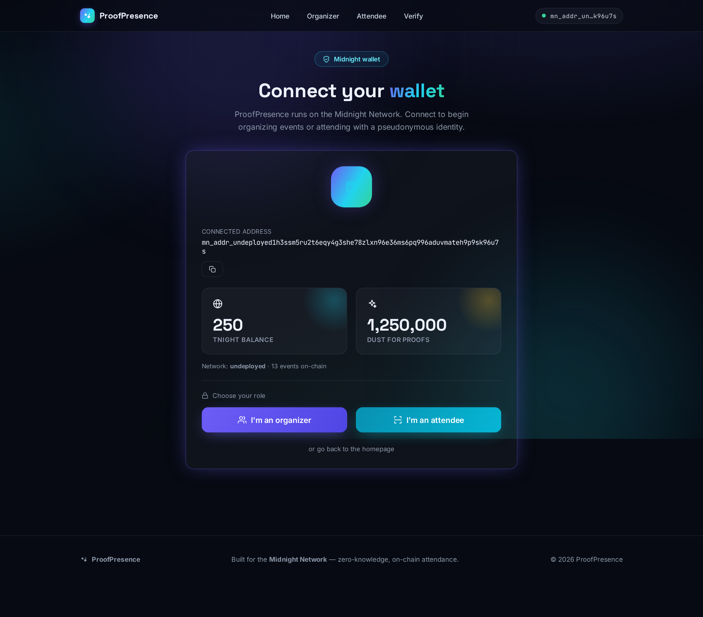
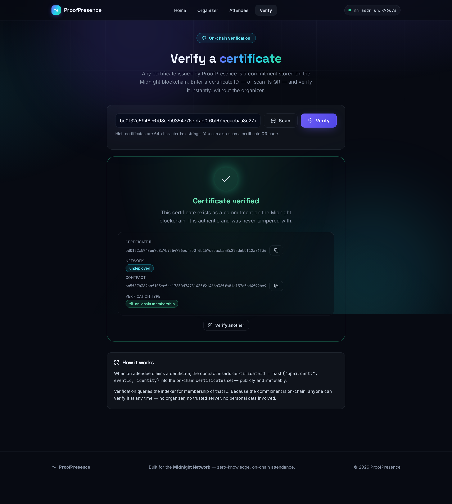
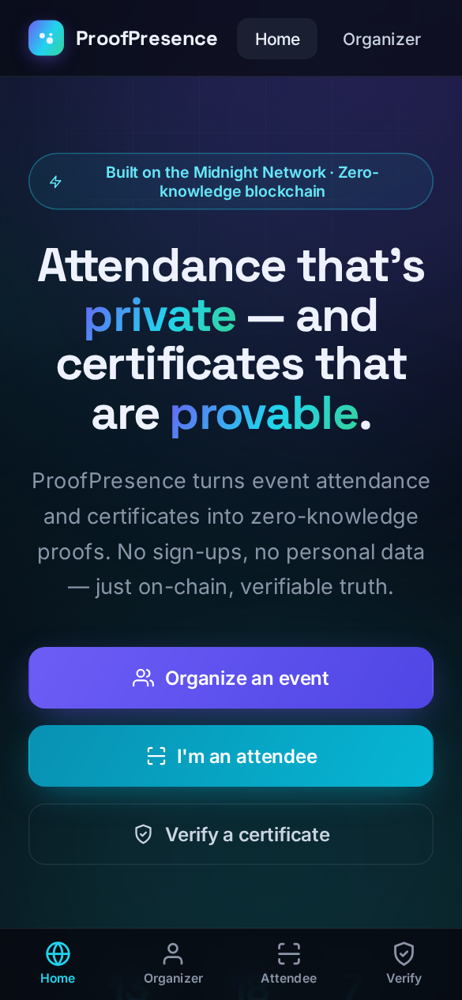
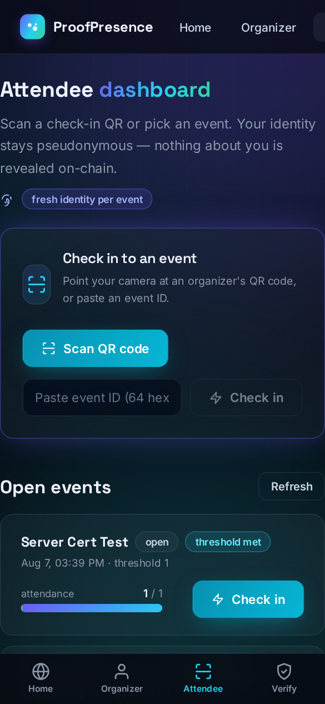

<div align="center">

# ⚡ ProofPresence

### Privacy-preserving event attendance & verifiable certificates on the **Midnight Network**

Zero-knowledge proof · pseudonymous identities · on-chain certificates · AI insights

[](https://docs.midnight.network)
[](https://www.typescriptlang.org)
[](https://react.dev)
[](https://docs.midnight.network/develop/tutorials)
[](./LICENSE)

</div>

---

**ProofPresence** turns event attendance into zero-knowledge proofs. Attendees check in with pseudonymous identities derived from secrets that never leave their device, attendance thresholds are enforced by a Compact smart contract on the **Midnight blockchain**, and every certificate is a **verifiable on-chain commitment** — no names, no emails, no personal data. Organizers get a live dashboard with AI-powered insights: attendance rate, peak check-in time, engagement score and certificate completion.

> 🏆 **Built for hackathons** — runs on a local Midnight devnet with one command, includes QR check-in/scanning, a polished dark UI, and a full demo flow you can show live to judges.

---


## 🌐 Deployed Contract

### Midnight Preview

- **Network:** Midnight Preview
- **Contract Address:** `e8482aba77255f5d8ac47fd17f0ffd5a5d8d7ee6c66bafae7c1e61cd51a7de28`

The contract was compiled and successfully deployed to the Midnight Preview network. The deployment address is also saved locally in `.midnight-state.json`.

> Note: The proof server runs locally because it is used for generating zero-knowledge proofs. The smart contract itself is deployed on Midnight Preview.

---

## ✨ Features

| | |
|---|---|
| 🔐 **Zero-knowledge check-in** | Every check-in is a ZK proof. The contract learns *that* someone attended, never *who* |
| 🎭 **Pseudonymous identities** | Attendee identity = `hash("ppai:attendee:", eventId, secret)` — secret stays local, on-chain hashes only |
| 🏅 **Verifiable certificates** | Certificates are commitments in the `certificates` ledger set; anyone can verify them without the organizer |
| 📱 **QR check-in & scanning** | Organizers display a check-in QR; attendees scan it with the in-app camera scanner (pure-JS decoder) |
| 📊 **Live attendance** | Polling dashboard shows attendance climbing in real time against the event threshold |
| 🤖 **AI insights** | Attendance rate, peak check-in time, on-time rate, engagement score and certificate completion % |
| 📈 **Organizer dashboard** | Create events, watch progress rings, inspect per-attendee status, issue certificates in one click |
| 🎫 **Attendee dashboard** | Join events, claim certificates once the threshold is met, keep a verifiable certificate wallet |
| 🔎 **Verification page** | Enter or scan a certificate ID and get an instant on-chain membership verdict |
| 🌙 **Polished dark UI** | Animated, glassmorphic, fully responsive (desktop + mobile bottom nav) |

---

## 🏗️ Architecture



**Privacy-preserving check-in, step by step**



**What the ledger sees:** an opaque 32-byte identity in a set. **What it never sees:** the attendee's name, the secret, or any link between identity and person.

> ℹ️ **Demo-mode note.** In production each attendee runs their own Midnight wallet. For a live hackathon demo, the server simulates distinct attendees by rotating a fresh identity secret per check-in — so a room full of people scanning the QR produces real, distinct on-chain attendance. No contract changes required.

---

## 📸 Screenshots

| Landing | Organizer dashboard |
|:---:|:---:|
|  |  |

| Event detail & AI insights | Attendee dashboard |
|:---:|:---:|
|  |  |

| Wallet connect | Certificate verification |
|:---:|:---:|
|  |  |

| Mobile — landing | Mobile — attendee |
|:---:|:---:|
|  |  |

---

## 🧱 Tech stack

- **Language / smart contract** — [Compact](https://docs.midnight.network/develop/compact) (`contracts/proofpresence.compact`)
- **Node.js** — TypeScript 6, `tsx`, Midnight.js 4.1 (`@midnight-ntwrk/midnight-js-*`)
- **Frontend** — React 19, Vite 8, React Router 7, hand-rolled design system (no UI framework, zero native deps)
- **QR** — `qrcode` (render) + `jsqr` (pure-JS camera decoding)
- **Infra** — Midnight devnet node, indexer and ZK proof server via `docker compose`

---

## 🚀 Quick start

### Prerequisites

- **Node.js ≥ 22**
- **Docker** (for the local Midnight devnet + proof server)
- **Midnight `compact` compiler** on your `PATH` — verify with `compact --version` (used by `npm run compile` to build the contract)

### 1. Install dependencies

```bash
npm install
```

### 2. Setup the local network, compile & deploy (one command)

```bash
npm run setup
```

This single command starts the devnet node + indexer + proof server (`docker compose up`), compiles the Compact contract, and deploys it to the local devnet. Prefer it over running the steps individually:

```bash
npm run proof-server:start    # optional — starts node + indexer + proof server
npm run compile               # optional — Compact -> managed artifacts
npm run deploy                # optional — deploys to the local devnet
```

### 3. Build & run the web app

```bash
npm run build:web                 # bundles the React SPA into web/dist
npm run server                    # API + SPA on http://127.0.0.1:8080
```

Open **http://127.0.0.1:8080** 🎉 — or use the standalone tools:

| Command | What it does |
| --- | --- |
| `npm run cli` | Interactive CLI (create/check-in/certify/ledger) |
| `npm run test` | On-chain end-to-end test (`scripts/e2e-check.ts`) |
| `npm run dev:web` | Vite dev server with `/api` proxy → `:8080` |

> **Non-local networks:** `npm run network` to switch to Midnight **preview** / **preprod**, then `setup` + `deploy` again (proof server still runs locally via docker).

---

## 🎯 How to demo it live

1. Open **Organizer** → create an event (name + attendance threshold).
2. Show the event's **Check-in QR** on a big screen.
3. Have judges/attendees open **Attendee** on their phones and scan it — each scan mints a distinct pseudonymous identity and attendance climbs **live**.
4. Once the threshold is met, click **"Issue certificates for all attendees"**.
5. Scan any certificate QR from the **Verify** page — it confirms on-chain membership instantly.

> 📱 **Phone scanning tip.** Check-in QR codes are built from the URL you're currently viewing — so if you open the organizer page at `http://127.0.0.1:8080`, the QR will encode `127.0.0.1` and phones won't reach it. Open the app via your machine's LAN IP (e.g. `http://192.168.x.x:8080`) before showing the QR, and phones on the same Wi-Fi will deep-link straight into the attendee app. The server binds `0.0.0.0`, so no extra configuration is needed.

---

## 🔒 How privacy works

The contract's only witness is a per-attendee `identitySecret`. All on-chain values are **one-way commitments**:

```
attendeeIdentity(eventId) = persistentHash( ["ppai:attendee:", eventId, identitySecret] )
certificateId(eventId, identity) = persistentHash( ["ppai:cert:", eventId, identity] )
```

- Check-in reveals only `attendeeIdentity` — a pseudonymous hash.
- Certificates reveal only `certificateId` — a commitment anyone can verify.
- The attendance threshold is enforced **inside the ZK circuit**, so the check-in proof is valid only if the count is correct.
- **Private**: real identity, which attendee checked in when, identity secrets, individual attendance patterns.
- **Public & verifiable**: events + thresholds, aggregate counts, certificate commitments, pseudonymous hashes.

The whole `PrivateState` (identity secrets) lives only in the server's local store for the demo; on-chain data is commitment-only.

---

## 🌐 API reference

| Method | Endpoint | Description |
| --- | --- | --- |
| `GET` | `/api/status` | Network, contract, wallet, balances |
| `GET` | `/api/ledger` | Raw ledger (events, certificates, sequence) |
| `GET` | `/api/events` | Events merged with capacity + AI insights |
| `GET` | `/api/events/:id` | Single event: attendees, insights, certificates |
| `GET` | `/api/insights?eventId=` | AI insights for an event |
| `GET` | `/api/verify?certificateId=` | On-chain certificate membership check |
| `POST` | `/api/events` | `{ name, threshold, capacity? }` → create event |
| `POST` | `/api/checkin` | `{ eventId }` → check in with a fresh identity |
| `POST` | `/api/certificate` | `{ eventId, attendeeId? }` → issue certificate(s) |

---

## 📁 Project structure

```
proofpresence-ai/
├── contracts/
│   └── proofpresence.compact      # Midnight Compact smart contract
├── src/
│   ├── server.ts                  # HTTP API + static SPA hosting + insights
│   ├── contract.ts                # compiled contract wiring + witnesses
│   ├── local-data.ts              # off-chain demo store (.server-data.json)
│   ├── wallet.ts / providers.ts   # Midnight wallet + provider setup
│   ├── network.ts / deploy.ts     # network config, deploy, setup
│   └── cli.ts                     # interactive CLI
├── scripts/
│   └── e2e-check.ts               # on-chain end-to-end test
├── web/
│   ├── src/pages/                 # Landing · Wallet · Organizer · Attendee · Verify
│   ├── src/components/            # Scanner, QR, insights, charts, ring, nav…
│   └── vite.config.ts
└── docs/screenshots/              # captured UI screenshots
```

---

## 🧭 Future scope

- **Real attendee wallets** — browser-based Midnight wallet (or wallet extension) so attendees hold their own identity secret; the server's demo simulation goes away entirely.
- **Offline / delegated check-in** — organizer relays ZK proofs without ever learning identities.
- **Richer insights** — engagement heatmaps, cohort retention across events, spam-score filtering, natural-language summaries generated from the insight metrics.
- **NFT-style certificate art + sharing** — generate shareable certificate cards with embedded verification QR.
- **Capacities & waitlists** — on-chain capacity enforcement and RSVP queue.
- **Tiered events** — threshold-gated content/venues, badge levels, multi-event loyalty.
- **Production hardening** — authN for organizer actions, key management via HSM, encrypted off-chain storage, multi-network CI.

---

## 📄 License

[MIT](./LICENSE)

---

<div align="center">

**ProofPresence** — attendance that's private, certificates that are provable.  
Built with ❤️ on the **Midnight Network**.

</div>
